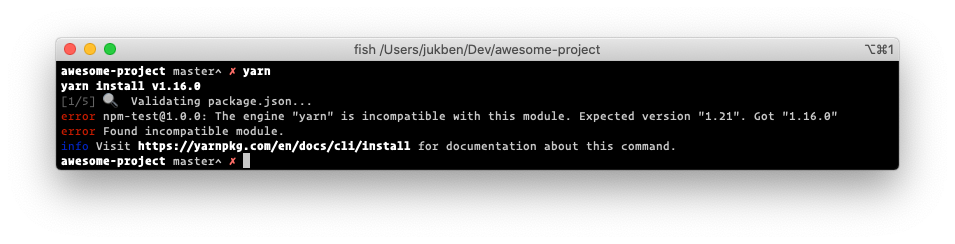

# One Yarn to rule them all

At [productboard](https://productboard.com), we rely heavily on Yarn — a fast, reliable, and secure package manager. For those of you who know the ecosystem, it will be pretty obvious how yarn.lock has helped us improve confidence in our projects’ dependencies. For the rest of you, here’s a clue from the official documentation:

> Your _yarn.lock_ file ensures that your package is consistent across installations by storing the versions of which dependencies are installed with your package.

In other words, this means you can be sure that you are working with the same dependencies (and their dependencies) as your colleagues. The same also applies to the CI systems we are using.

Sounds good, right? Sure! But things aren’t always so straightforward. Different versions of Yarn may produce a different yarn.lock. This happened to me when Yarn introduced the integrity field.

When this happens, you might end up requesting changes to your colleagues’ PR to upgrade their Yarn accordingly and regenerate the file to keep the diff clean.

So what now? Should we update the main Readme with the supported version of Yarn? No! We can go one better…

## Enforcing the specific version

One way to enforce a version within one project is to use the engines field in package.json (see [documentation](https://docs.npmjs.com/files/package.json#engines)).

    {
      "engines": {
        "yarn": "1.21"
      }
    }

This allows you to enforce a specific version of yarn for everyone who will run Yarn commands including add, for example.

In this case, when you try to install a new package, you may get this message.

That’s better. But still, you need to install the requested version manually. Now, let’s imagine that the recommended version will change — you would have to repeat the process again! Frustrating, eh? Don’t worry, there’s a better way…

## One Yarn for everyone

This headline may sound silly but bear with me. The authors of Yarn have been facing this specific issue themselves. Thankfully, they’ve come up with a great solution.

Ladies and gentleman, allow me to introduce the best way to keep your Yarn version aligned across the team: [yarn policies](https://legacy.yarnpkg.com/lang/en/docs/cli/policies/).

What is Yarn policies all about?

> yarn policies set-version offers a simple way to check in your Yarn release within your repository. Once you run it, your configuration will be updated in such a way that anyone running a Yarn command inside the project will always use the version you set.

And how do I use it?

yarn policies set-version

This command will set the latest stable Yarn as the default for everyone working in the same repository. It’s as simple as that.

A Yarn binary snapshot will be stored within .yarn/releases along with the updated yarn-path in the .yarnrc configuration file. Now, you’ll be using the locally “installed” version of Yarn.

And last but not least, make sure to push these changes to your remote, so everyone within the team gets the same benefits — one exact, locally scoped version of Yarn, no matter what version they have installed. No more yarn.lock deviations! _Beautiful._

### Final touches

If you’re using GitHub, you might be familiar with the language distribution dashboard. This is how our repository looked before we introduced the change I just walked you through. Let’s say you’re using TypeScript, as we do.

And this is how it looks after I merged my lovely changes.

Wait, what? Allow me to explain…

GitHub uses a program called [Linguist](https://github.com/github/linguist) to calculate code distribution. And by default, it processes all the versioned files.

Thankfully, you can control this process. Simply edit your .gitattributes as follows to ignore this file from the graph.

    .yarn/releases/*.js linguist-vendored

And that’s it! If it’s not versioned, it didn’t happen!

_I hope you enjoyed this article. If you like it or have any questions, please feel free to comment below👇. As you can see, we are solving interesting problems on a daily basis. If you’d like to know more, feel free to ping us. If you’d like to join us on our journey, check out [careers.productboard.com](https://careers.productboard.com/)!_

Kudos to [Martin Hochel](https://twitter.com/@martin_hotell) for proofread!
